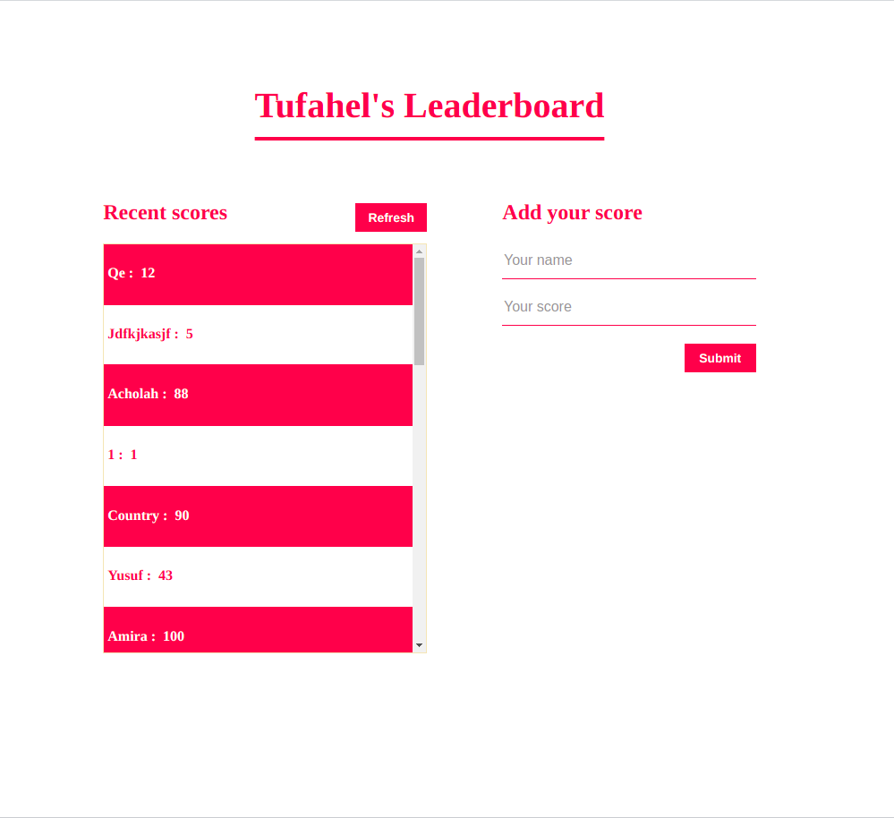

# Title-Info
> This is a leaderboard project made by using async await and fetch-api.

# ScreenShots
- 

## Built With
- HTML
- JavaScript
- CSS
- VScode

## Live Demo
For the link to the live demo, [Click here](https://tufahel.github.io/leaderboard/)

## Getting Started
To get a local copy up and running you just need to follow the following steps;
- Clone this repository with
git clone https://github.com/Tufahel using your terminal or command line.
- run code . to open it in vscode
- enter `npm install` in terminal
- enter `npm run build` in terminal
- enter `npm start`, and project will open in you default browser.

## Authors

👤 **Author**

- GitHub: [@Tufahel](https://github.com/Tufahel)
- Twitter: [@TufahelAhmed](https://twitter.com/TufahelAhmed)
- LinkedIn: [@Tufahel Ahmed](linkedin.com/in/tufahel-ahmed)

## 🤝 Contributing

Contributions, issues, and feature requests are welcome!

Feel free to check the [issues page](../../issues/).

## Show your support

Give a ⭐️ if you like this project!

## 📝 License

This project is [MIT](./MIT.md) licensed.
